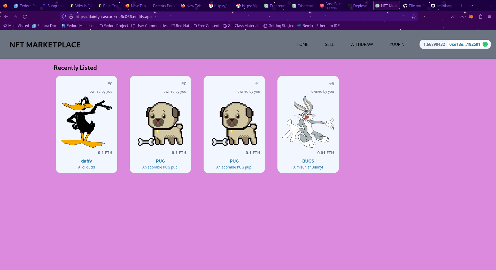

# NFT Marketplace

A decentralized NFT marketplace built using Next.js, GraphQL, and Solidity.



## Table of Contents

- [Introduction](#introduction)
- [Features](#features)
- [Demo](#demo)
- [Installation](#installation)
- [Usage](#usage)
- [How It Works](#how-it-works)
- [Technologies Used](#technologies-used)
- [Contributing](#contributing)
- [License](#license)

## Introduction

This project is a decentralized NFT marketplace similar to OpenSea. It allows users to buy, sell, and explore unique digital assets stored as NFTs on the Ethereum blockchain. The marketplace is built with a modern web frontend using Next.js, backed by a GraphQL API for efficient data retrieval and Solidity smart contracts to manage the NFT transactions.

## Features

- Browse and search for NFTs
- View detailed NFT information and attributes
- Create an account and connect a wallet
- Buy and sell NFTs securely using smart contracts

## Demo

Check out our live demo [here](https://dainty-cascaron-e6c066.netlify.app/).

## Installation

1. Clone the repository:

```bash
git clone https://github.com/helloiampratyush/nftMarketPlace-frontEnd.git
cd nftMarketPlace-frontEnd.git
```

2. Install dependency

```bash
yarn install
```
3.run server

```bash
yarn run dev
```
# Usage

 1. Access the marketplace at http://localhost:3000
 2.  Connect Your Ethereum Wallet
       * To start buying and selling NFTs, connect your Ethereum wallet to the marketplace
       * The marketplace will guide you through the wallet connection process
 3. Browse NFTs:
       - Explore the available NFTs listed on the marketplace.
       - View detailed information and attributes of each NFT.
 4. Buy NFTs:
       - In the "Buy NFT" section, select the desired NFT and confirm the purchase using your connected Ethereum wallet.

 5. Sell NFTs:
       - List your NFTs for sale in the "Sell NFT" section.
       - Specify the NFT details and price for potential buyers.

 6. Manage Your NFTs:
       - Access the "My NFTs" section to see your owned NFTs and their details.
       - Update the price of your owned NFTs that are listed for sale.

 7. Withdraw Earnings:
       - If your listed NFT is purchased, you can withdraw your earnings from the marketplace.


## How It Works

1. Users create an account and connect their Ethereum wallet to the marketplace.

2. **Selling NFTs (Based on ERC721):**
   - Sellers can mint new NFTs or list existing ERC721 NFTs for sale.
   - In the "Sell NFT" section, sellers specify the NFT details, including price and description.
   - Upon listing, the NFT is added to the marketplace for potential buyers to discover.

3. **Buying NFTs:**
   - Buyers can explore the marketplace and view available NFTs.
   - In the "Buy NFT" section, buyers select the NFT they wish to purchase and confirm the transaction using their connected Ethereum wallet.
   - Smart contracts handle the secure transfer of ownership, ensuring a tamper-proof transaction on the Ethereum blockchain.

4. **Managing Your NFTs:**
   - Users have a personalized dashboard that remembers their NFTs.
   - The "My NFTs" section displays a collection of NFTs owned by the user, along with detailed information about each NFT.

5. **Withdrawal of Earnings:**
   - If a buyer purchases your listed NFT, the sale amount is held securely in the marketplace's smart contract.
   - Sellers can access the "Withdraw Earnings" section and initiate a withdrawal to claim their earnings from the successful NFT sale.

By integrating ERC721 tokens and smart contracts, our NFT marketplace provides a seamless and secure environment for trading unique digital assets.

## Technologies Used

- Next.js
- GraphQL
- Solidity
- Ethereum
- Web3.js
- Tailwind CSS
- Typescript

## Contributing

Contributions are welcome! If you'd like to contribute to this project, please follow the guidelines in [CONTRIBUTING.md](CONTRIBUTING.md).

## License

This project is licensed under the .


